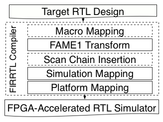

# MIDAS

MIDAS is a Chisel & FIRRTL library for generating FPGA-accelerated simulators
automatically from Chisel-based RTL design, and is the basis for simulator
generation in [FireSim](https://fires.im).

MIDAS expands on the work of
[Strober](http://dl.acm.org/citation.cfm?id=3001151) that was originally
developed for sample-based energy simulation.  MIDAS was the basis for DESSERT
(FPL2018) and includes FASED (FPGA2019), a generator of high-fidelity,
reconfigurable LLC and DRAM memory-system models.

MIDAS documentation is gradually being migrated to [FireSim's
Read-The-Docs](https://docs.fires.im), which is actively maintained. API
descriptions that follow are obselete, but the general flow remains mostly unchanged.

## Publications

* Donggyu Kim, Adam Izraelevitz, Christopher Celio, Hokeun Kim, Brian Zimmer, Yunsup Lee, Jonathan Bachrach, and Krste Asanović, **"Strober: Fast and Accurate Sample-Based Energy Simulation for Arbitrary RTL"**, International Symposium on Computer Architecture (ISCA-2016), Seoul, Korea, June 2016. ([ACM DL](https://dl.acm.org/citation.cfm?id=3001151), [Slides](http://isca2016.eecs.umich.edu/wp-content/uploads/2016/07/2B-2.pdf))
* Donggyu Kim, Christopher Celio, David Biancolin, Jonathan Bachrach, and Krste Asanović, **"Evaluation of RISC-V RTL with FPGA-Accelerated Simulation"**, The First Workshop on Computer Architecture Research with RISC-V (CARRV 2017), Boston, MA, USA, Oct 2017. ([Paper PDF](doc/papers/carrv-2017.pdf))
* Sagar Karandikar, Howard Mao, Donggyu Kim, David Biancolin, Alon Amid, Dayeol Lee, Nathan Pemberton, Emmanuel Amaro, Colin Schmidt, Aditya Chopra, Qijing Huang, Kyle Kovacs, Borivoje Nikolić, Randy Katz, Jonathan Bachrach, and Krste Asanović, **“FireSim: FPGA-Accelerated Cycle-Exact Scale-Out System Simulation in the Public Cloud”**, In proceedings of the 45th ACM/IEEE International Symposium on Computer Architecture (ISCA 2018), Los Angeles, June 2018. ([Paper PDF](https://sagark.org/assets/pubs/firesim-isca2018.pdf), [IEEE Xplore](https://ieeexplore.ieee.org/document/8416816)) **Selected as one of IEEE Micro’s “Top Picks from Computer Architecture Conferences, 2018”.** 
* Donggyu Kim, Christopher Celio, Sagar Karandikar, David Biancolin, Jonathan Bachrach, and Krste Asanović, **“DESSERT: Debugging RTL Effectively with State Snapshotting for Error Replays across Trillions of cycles”**, In proceedings of the 28th International Conference on Field Programmable Logic & Applications (FPL 2018), Dublin, Ireland, August 2018. ([IEEE Xplore](https://ieeexplore.ieee.org/abstract/document/8533471))
* David Biancolin, Sagar Karandikar, Donggyu Kim, Jack Koenig, Andrew Waterman, Jonathan Bachrach, Krste Asanović, **“FASED: FPGA-Accelerated Simulation and Evaluation of DRAM”**, In proceedings of the 27th ACM/SIGDA International Symposium on Field-Programmable Gate Arrays, Seaside, CA, February 2019. ([Paper PDF](https://people.eecs.berkeley.edu/~biancolin/papers/fased-fpga19.pdf))

## Host vs Target

To avoid confusion, we make a distinction between *host* and *target* machines.

**Target**: the machine being simulated. For example, an SoC derived from Rocket Chip.

**Host**: the machine that executes ("hosts") the simulation. For example, this could be an Xilinx ZC706 (FPGA + embedded CPU), or an X86 desktop with a PCI-E attached FPGA like a Xilinx VC707, or Intel DE5.

MIDAS's primary function is to generate a high-performance simulator of a *target* from its source RTL, that executes on a hybrid CPU-FPGA *host*.

## Dependencies

This repository depends on the following projects:
* [Chisel](https://github.com/freechipsproject/chisel3): Target-RTL that MIDAS transformed must be written in Chisel RTL in the current version. Additionally, MIDAS RTL libraries are all written in Chisel.
* [FIRRTL](https://github.com/freechipsproject/firrtl): Transformations of target-RTL are performed using FIRRTL compiler passes.
* [RocketChip](https://github.com/freechipsproject/rocket-chip): Rocket Chip is not only a chip generator, but also a collection of useful libraries for various hardware designs.
* [barstools](https://github.com/ucb-bar/barstools): Some additional technology-dependent custom transforms(e.g. macro compiler) are required when Strober energy modelling is enabled.

## Getting Started

### MIDAS Compiler

First of all, we assume the target design is written in Chisel. The RTL that describes the FPGA-accelerated simulator is generated from target RTL (an elaborated chisel module) and a configuration that are passed to `midas.MidasCompiler`:
```scala
// mod: Module (target design)
// dir: File (target directory)
// p: config.Parameters (midas configuration)
midas.MidasCompiler(mod, dir)(p)
```
If you have a JSON file describing the target technology generated by [HAMMER](https://github.com/ucb-bar/hammer) for Strober energy modeling (note this is not necessary for performance simulation), pass it as:
```scala
// lib: File (technology description)
midas.MidasCompiler(mod, dir, Some(lib))(p)
```

### MIDAS Configurations

The MIDAS configuration is responsible for describing what models the Compiler should bind to the I/O of your target RTL, and for enabling simulation services that require in-FPGA support (like target-state snapshotting).  

The default MIDAS parameters are given in [src/main/scala/midas/Config.scala](https://github.com/ucb-bar/midas/blob/readme/src/main/scala/midas/Config.scala). To generate the RTL for a Xilinx Zynq FPGA-host, pass the `ZynqConfig` to the Compiler. To also enable Strober energy modelling, pass the `ZynqConfigWithSnapshot` to the Compiler.

MIDAS uses the same parameterization library as Rocket Chip, and thus MIDAS configurations can be defined and changed in the manner.

### MIDAS Software Driver

In MIDAS, a CPU-hosted *driver* controls the execution of the simulator. The driver is written in C++ by the user. The simplest form of driver uses `peek`, `poke`, `step`, `expect` functions as in [Chisel testers](https://github.com/freechipsproject/chisel-testers.git). The first step is define a virtual class that inherets from `simif_t`. This class describes the execution of the simulator and is agnostic of the host platform. Next, this class is concretized for each host platform you wish to use, usually twice: once for your FPGA-host platform, and again, for a CPU-only host-platform in which the FPGA-hosted components are simulated using an RTL simulator like Verilator or Synopsys VCS. As an example, here is a software driver for GCD (e.g. in `GCD.h`):
```c++
#include "simif.h"

class GCD_t: virtual simif_t
{
public:
  void run() {
    uint32_t a = 64, b = 48, z = 16; //test vectors
    target_reset();
    do {
      poke(io_a, a);
      poke(io_b, b);
      poke(io_e, cycles() == 0 ? 1 : 0);
      step(1);
    } while (cycles() <= 1 || peek(io_v) == 0);
    expect(io_z, z);
  }
};
```

The concretized class for CPU-only simulation (from in `GCD-emul.cc`). We refer to this as an emulator (as it emulates the FPGA-accelerated simulator).

```c++
#include "simif_emul.h"
#include "GCD.h"

class GCD_emul_t:
  public simif_emul_t,
  public GCD_t { };

int main(int argc, char** argv)
{
  GCD_emul_t GCD;
  GCD.init(argc, argv, true);
  GCD.run();
  return GCD.finish();
}
```

The concretized class for an Xilinx Zynq host platform (from `GCD-zynq.cc`).

```c++
#include "simif_zynq.h"
#include "GCD.h"

class GCD_zynq_t:
  public simif_zynq_t,
  public GCD_t { };

int main(int argc, char** argv) 
{
  GCD_zynq_t GCD;
  GCD.init(argc, argv, true);
  GCD.run();
  return GCD.finish();
}
```

Fields that greater than 64 bits wide must be declared with `mpz_t` in [GMP](https://gmplib.org/), and passed to `peek`, `poke`, `expect` functions.

To compile Verilator/VCS tests or the FPGA simulation driver, `make` is invoked in [src/main/cc](src/main/cc). Thus, the top-level makefile is likely to contain the wrapper as follows:
```makefile
compile-driver:
  $(MAKE) -C $(midas_dir)/src/main/cc [verilator | vcs | <platform>] [variable="<value>"]*
```

The variables are:
* `PLATFORM`: Platform name (zynq by default)
* `DESIGN`: Target design name
* `GEN_DIR`: The directory containing generated files from MIDAS Compiler (=`dir`)
* `OUT_DIR`: The directory for output files (`GEN_DIR` by default)
* `DRIVER`: The c++ driver files written by the user (not including header files)
* `CXXFLAGS`: additional compiler flags

### Generate a Bitstream for the FPGA-host

The MIDAS compiler is only responsible for generating the RTL that describes the FPGA-hosted components of the simulator. This RTL needs to be compiled into a FPGA-host specific project to generate a bitstream. We provide one backend flow for now, [midas-zynq](https://github.com/ucb-bar/midas-zynq) wich provides support for Xilinx Zynq hybrid CPU-FPGAs. 

### Run Verilator/VCS tests & FPGA simulation

To start Verilator/VCS tests, or FPGA simulation, simply run:
```
cd <output_dir>
./[binary executable] [+<argument>=<value>]
```

The argument list is as follows:
* `+loadmem=`: hex file to initialize the main memory
* `+fastloadmem`: enables fast loadmem, not through the loadmem unit (tests only)
* `+seed=`: seed value for the random generator (optional)
* `+sample=`: file name for sample snapshots (strober only)
* `+samplenum=`: number of sample snapshots (strober only)
* `+tracelen=`: the length of I/O traces (strober only)

Note that MIDAS emulation and FPGA simulation share most command-line arguments.

### Replay Samples

If you enabled Strober enery modeling, the file containing random RTL sample snapshots will be generated at the end of the simulation run. The snapshots will be replayed in RTL/gate-level simulation for power estimation.

First compile the target design using [`strober.replay.Compiler`](src/main/scala/strober/replay/Compiler.scala):
```scala
// mod: Module (target design)
// dir: File (target directory)
// lib: File (technology description)
strober.replay.Compiler(mod, dir, Some(lib))
```
This makes sure the RTL for simulation and sample replays are the same. Run CAD tools (we recommend using [HAMMER](https://github.com/ucb-bar/hammer)) using the generated Verilog file.

The RTL/gate-level simulators are also compiled in [src/main/cc](src/main/cc):
```makefile
compile-replay:
  $(MAKE) -C $(midas_dir)/src/main/cc <simulator binary path> [variable="<value>"]*
```

The variables, mostly shared with the simulator driver compilations, are:
* `PLATFORM`: Platform name (zynq by default)
* `DESIGN`: Target design name
* `GEN_DIR`: The directory containing generated files from replay Compiler (=`dir`)
* `OUT_DIR`: The directory for output files (`GEN_DIR` by default)
* `TARGET_VERILOG`: The Verilog file for replays (Verilog files from `strober.replay.Compiler` by default). This variable should be overriden if the gate-level designs from CAD tools are used.
* `REPLAY_BINARY`: The simulator binary path equal to the makefile target (=`<simulator binary path>`) (`$(OUT_DIR)/$(DESIGN)-replay` by default)

Finally, run the following command to replay samples:
```
cd $(OUT_DIR)
./<simulator-binary> +sample=<sample file> [+verbose] [+match=<match file>] [+waveform=<vpd file path>] [+vcdfile=<vcd file path>]
```
Note that `+match=<match file path>` is necessary for gate-level simulation to find the state mapping between RTL and gate-level as explained in the [ISCA'16 Strober paper](http://dl.acm.org/citation.cfm?id=3001151).

MIDAS also contains useful scripts for sample replays in [src/main/resources/replay](src/main/resources/replay):
* [fm-match.py](src/main/resources/replay/fm-match.py): generates the match file for sample replays from Synopsys Formality report files and SVF files.
* [fm-macro.py](src/main/resources/replay/fm-macro.py): finds the state mapping for SRAMs
* [replay-samples.py](src/main/resources/replay/replay-samples.py): split samples and replay each sample in a separate simulation instance.
* [estimate-power.py](src/main/resources/replay/estimate-power.py): compute and aggregate power estimates of each sample using [HAMMER](https://github.com/ucb-bar/hammer).

For details, run `./<script> -h`.

## Internal Architecture

This section describes the internal architecture of MIDAS for advanced users.

### Custom Transforms in the MIDAS Complier

The [`MidasTransforms`](src/main/scala/midas/passes/MidasTransforms.scala) composes custom compiler passes to generate FPGA simulators as follows:


The MIDAS passes are designed to act on a low-firrtl graph that, in a VLSI flow, would then be emitted to verilog. This accomplishes two things:
1) This minimizes the divergence between VLSI-implementation RTL and the RTL being simulated
2) Saves FPGA resources, as MIDAS transformations can "liven" what would be dead-target RTL, preventing them from being optimized away in later invocations of the FIRRTL optimization passes. 

### Macro Mapping (Optional)

*Macro Mapping* maps technology-independent macro blocks to technology-dependent macro blocks (SRAMs). This pass is initiated by passing a JSON description to the MIDAS compiler. For implementation details, refer to [barstools](https://github.com/ucb-bar/barstools).

### FAME1 Transform
[*FAME1 transform*](src/main/scala/midas/passes/Fame1Transform.scala) decouples the target clock from the host clock by attaching enable signals to all state elements. This enables parts of simulator to stall when it is missing ready, allowing the simulator to tolerate variable latencies in the host-platform, and ensuring simulations are deterministic. With FAME1-transformed RTL, the target-time advances in the simulator is governed by timing-token flow control. The details of the transform are found in [the ISCA'16 paper](http://dl.acm.org/citation.cfm?id=3001151). More detail on host-target decoupling can be found in [the FAME ISCA'10 paper](https://people.eecs.berkeley.edu/~krste/papers/fame-isca2010.pdf). We direct the interested reader to [APort Networks](https://dl.acm.org/citation.cfm?id=1575775) and [Latency-Insensitive Bounded-Dataflow Network](http://people.csail.mit.edu/vmurali/papers/libdns.pdf) which describe two different ways implement host-target clock decoupling. 

### Scan Chain Insertion (Optional)
[*Scan chain insertion*](src/main/scala/strober/passes/AddDaisyChain.scala) adds scan chains to take RTL state snapshots for sample replays. Notably, [*all scan chains are implemented in Chisel*](src/main/scala/strober/core/DaisyChain.scala), and this pass elaborates and compiles additional Chisel RTL from within a FIRRTL pass. This technique, called *Inline Compilation*, removes the necessity of writing all hardware logic with IR, significantly reducing the pass writing overhead. Scan-chain metadata are dumped (e.g. `<design>.chain`) by second pass: [DumpChains](src/main/scala/strober/passes/DumpChain.scala). The details of scan-chain insertion passes are found in the [ISCA'16 Strober paper](http://dl.acm.org/citation.cfm?id=3001151).

### Simulation Mapping
[*Simulation mapping*](src/main/scala/midas/passes/SimulationMapping.scala) wraps the transformed target design by inserting timing token channels / trace buffers. The result is a platform-independent simulation module for token-based simulation. This pass compiles [the wrapper written in Chisel](src/main/scala/midas/core/SimWrapper.scala) with *Inline Compilation*. The details on communication channels and token-based simulation are found in the [ISCA'16 Strober paper](http://dl.acm.org/citation.cfm?id=3001151).

### Platform Mapping
[*Platform mapping*](src/main/scala/midas/passes/PlatformMapping.scala), the ultimate MIDAS-compiler pass, links all simulation modules hosted on FPGA with platform-specific logic. First of all, [`FPGATop`](src/main/scala/midas/core/FPGATop.scala) instantiates and connects abstract timing models and helpers implemented using [`Widget`](src/main/scala/midas/widgets) as well as the target module generated by simulation mapping. Next, there are [platform-specific shims](src/main/scala/midas/platform) to adapt the AXI master-slave interface to the platform-specific interfaces. As a final step, the compiler pass compiles the platform shim with *Inline Compilation*, dumps a target and platform specific C++ header file (`<design>-const.h`) for the software driver, and thus, generates the FPGA simulator.

## Advanced Usage

### Endpoints

The easiest way to write a testbench for the software driver is use `poke`, `peek`, `expect` for each I/O port along with `step`. However, this may not be proper in many situations as it increases communication overhead between the FPGA and the software driver. Thus, we introduce [`Endpoint`](src/main/scala/midas/core/Endpoints.scala) that translates the low-level timing tokens into higher-level transactions and vice versa through [a specialized `Widget`](src/main/scala/midas/widgets/NastiIO.scala). The intuition behind is the systems we are building are nicely divided into FPGA and software such that the communication between them are rare (e.g. through decoupled channels).

#### Custom Endpoint Widget Implementation

First, implement a custom endpoint widget by inheriting `midas.widget.EndpointWidget`. Also, declare `hPort` in `midas.widget.EndpointWidgetIO` with the type of the top-level I/O ports. `hPort`. The top-level target design ports on which the endpoint operates are wrapped by `hPort` of type `HostPortIO` that has three following fields:

* `fromHost`: ready/valid signals for tokens from the host side (toward the target design).
* `toHost`: ready/valid signals for tokens toward the host side (from the target design).
* `hBits`: signals seen by target design with the same type of the target ports. In general, its type is an aggregated type (e.g. `DecoupledIO`).

Target reset tokens are presented through `tReset` as `DecoupledIO`. Thus, define *fire* with `io.hPort.toHost.hValid`, `io.hPort.fromHost.hReady`, `io.tReset.valid`, which means all timing tokens from the target design are presented and the target is ready to accept timing tokens from the widget, and additional timing conditions if necessary. Then, the tokens from the widget are generated by connecting *fire* to `io.hPort.fromHost.hValid`. In the same way the tokens toward the widget are consumed by connecting *fire* to `io.hPort.toHost.hReady` and `io.tReset.ready`. In addition, define *done* which indicates all outstanding transactions are done and no more timing tokens are available from the target design.

Next, add buffers for the transactions and connect them to `io.hPort.hBits`. In general, transactions are modeled with `DecoupledIO`, but there are exceptions like UART. Timing is also modeled with respect to outstanding transactions. All transactions and timing information is exchanged through their corresponding buffers.

Finally, generate memory-mapped registers for the transaction buffers and control/status signals with the following functions:
```scala
/*** The following functions return assigned addresses ***/
// assign an address to `reg` and attach it to the control register file
def attach(reg: Data, name: String, permissions: Permissions = ReadWrite): Int
// generate a register for `wire` and attach it to the control register file
// masterDriven = true if wire is output of target
def genAndAttachReg[T <: Data](wire: T, name: String, default: Option[T] = None, masterDriven: Boolean = true): Int
// attach the sink of the buffer to the control register file
def attachDecoupledSink(channel: DecoupledIO[UInt], name: String): Int
// attach the source of the buffer to the control register file
def attachDecoupledSource(channel: DecoupledIO[UInt], name: String): Int

/*** The following functions return generated registers ***/
// generate a write-only register for `wire` and attach it to the control register file
def genWOReg[T <: Data](wire: T, name: String): T
def genWORegInit[T <: Data](wire: T, name: String, default: T): T
// generate a read-only register for `wire` and attach it to the control register file
def genROReg[T <: Data](wire: T, name: String): T
def genRORegInit[T <: Data](wire: T, name: String, default: T): T
```
`name` is used to generate macros for memory-mapped registers. Note that the maximum width of each communication is platform-dependent (given as `io.ctrl.nastiXDataBits`), so each word should be chopped and sent if it exceeds the max width. Finally, don't forget to call `genCRFile()` at the end, which elaborates all assigned control registers. The APIs are not finalized yet, so they are subject to change in later releases.

#### Custom Endpoint Widget Instantiation

Declare `matchType` and `widget` in the inherited class of [`midas.core.Endpoint`](src/main/scala/midas/core/Endpoints.scala). The `matchType` method figures out which I/O ports are connected to this endpoint with type matching. The `widget` method instantiates the endpoint widget. Endpoints are instantiated with the parameter `EndpointKey` like:
```scala
class WithMyEndpoints extends Config(new Config((site, here, up) => {
  case midas.EndpointKey =>
    // Includes all endpoints defined by the default config
    up(EndpointKey) ++
    // Adds custom endpoints
    midas.core.EndpointMap(Seq(new MyEndpoint1, new MyEndpoint2))
}

class MyZynqConfig extends Config(new WithMyEndpoints ++ new midas.ZynqConfig)
```

#### Endpoint Software

To write endpoint software, implement a derived class of [`endpoint_t`](src/main/cc/endpoints/endpoint.h). Software models can be also plugged using this class. You are supposed to implement two methods.

* `tick`: performs operations on outstanding transactions. This method may interact with software components.
* `terminate`: indicates that the endpoint is calling for simulation to terminate.
* `exit_code`: indicates what caused the endpoint to signal for termination.

Therefore, in the software driver, non-blocking `n` steps are taken with
`step(n, false)`, and `tick` functions of all endpoints should be called until
simif::done() returns true (the simulator has advanced n cycles) or one of the endpoints
has signaled that the simulation should terminate.

`tick` is implemented using `read` and `write` functions for memory-mapped
registers. Once custom endpoints are instantiated, macros for memory mapped
registers are generated in `<Design>-const.h`. If you implemented an endpoint
widget `FooWidget` and generated a memory mapped register with `name` being
`"bar"`, this register can be read and written with `read(FOOWIDGET_0(bar))`
and `write(FOOWIDGET_0(bar), ...)`, respectively.

