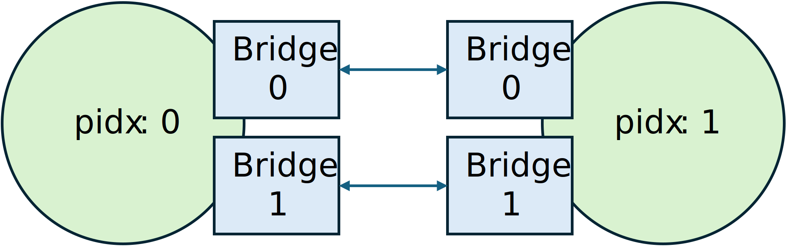

Running Exact Mode Simulations
==============================

In this section, we provide a step-by-step tutorial on how to partition a *RocketTile*
out from the *SoC* and run exact-mode simulations on EC1 F1. Similar steps can be
applied to perform locally partitioned FPGA simulations. This assumes that you have read
the :ref:`FireAxe running fast-mode simulations<FIREAXE-FAST-MODE>`.

1. Building Partitioned Sims: Setting up FireAxe Target configs
---------------------------------------------------------------

We will be reusing the FireAxe target configurations from
:ref:`fast-mode<FIREAXE-FAST-MODE>`.

.. literalinclude:: ../../../sim/midas/src/main/scala/configs/FireAxeTargetConfigs.scala
    :language: scala
    :start-after: DOC include start: F1 Rocket Partition
    :end-before: DOC include end: F1 Rocket Partition

2. Building Partitioned Sims: `config_build_recipes.yaml`
---------------------------------------------------------

We can specify the ``config_build_recipes.yaml`` at this point. One thing to note is
that we added the ``ExactMode_`` in the ``PLATFORM_CONFIG`` field. This indicates to the
FireAxe compiler to perform additional steps while partitioning so that the target
behavior can be simulated in a cycle-exact manner.

.. literalinclude:: ../../../deploy/sample-backup-configs/sample_config_build_recipes.yaml
    :language: yaml
    :start-after: DOC include start: F1 Exact Rocket Partition Build Recipe
    :end-before: DOC include end: F1 Exact Rocket Partition Build Recipe

3. Running Partitioned Simulations: `user_topology.py`
------------------------------------------------------

Again, we have to specify the :gh-file-ref:`deploy/runtools/user_topology.py` to run
FireAxe simulations.

.. literalinclude:: ../../../deploy/runtools/user_topology.py
    :language: python
    :start-after: DOC include start: user_topology.py fireaxe_rocket_exactmode_config
    :end-before: DOC include end: user_topology.py fireaxe_rocket_exactmode_config

We should go over a couple of changes that are made compared to the fast-mode
configuration.

First of all the FireAxe topology specified by ``edges`` has changed. This is because in
the exact-mode, the compiler has to generate multiple communication channels (or edges)
in between the partitions in order to model combinational logic correctly.

The partitioning topology now looks like this:

The upper edge connecting partition 0's bridge 0 to partition 1's bridge 0 can be
described like this:

.. literalinclude:: ../../../deploy/runtools/user_topology.py
    :language: python
    :start-after: DOC include start: fireaxe_rocket_exactmode_config edge 0
    :end-before: DOC include end: fireaxe_rocket_exactmode_config edge 0

The lower edge connecting partition 0's bridge 1 to partition 1's bridge 1 can be
described like this:

.. literalinclude:: ../../../deploy/runtools/user_topology.py
    :language: python
    :start-after: DOC include start: fireaxe_rocket_exactmode_config edge 1
    :end-before: DOC include end: fireaxe_rocket_exactmode_config edge 1

We also changed the partition mode to ``EXACT_MODE``:

.. literalinclude:: ../../../deploy/runtools/user_topology.py
    :language: python
    :start-after: DOC include start: fireaxe_rocket_exactmode_config mode
    :end-before: DOC include end: fireaxe_rocket_exactmode_config mode

4. Running Partitioned Simulations: `config_runtime.yaml`
---------------------------------------------------------

Now we can update ``config_runtime.yaml`` to run FireAxe simulations.

.. code-block:: yaml

    target_config:
        topology: fireaxe_rocket_exactmode_config
