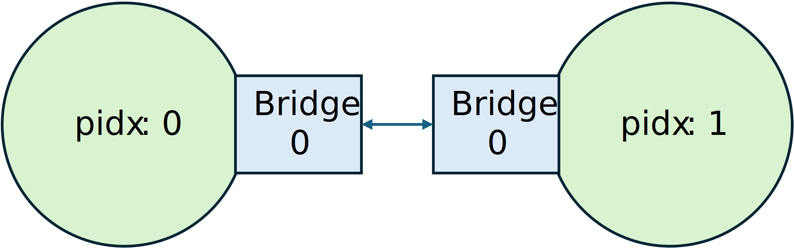

.. _fireaxe-fast-mode:

Running Fast Mode Simulations
=============================

In this section, we provide a step-by-step tutorial on how to partition a *RocketTile*
out from the *SoC* and run fast-mode simulations using 2 FPGAs on EC2 F1. This assumes
that you have completed the :ref:`AWS F1 Getting Started
Guide<AWS-F1-Getting-Started-Guide>` and that you are familiar with the FireSim
workflow.

1. Building Partitioned Sims: Setting up FireAxe Target configs
---------------------------------------------------------------

To build bitstreams for partitioned simulations, we need specify which modules we want
to partition out. We can do that in
:gh-file-ref:`sim/midas/src/main/scala/configs/FireAxeTargetConfigs.scala`.

.. literalinclude:: ../../../sim/midas/src/main/scala/configs/FireAxeTargetConfigs.scala
    :language: scala
    :start-after: DOC include start: F1 Rocket Partition
    :end-before: DOC include end: F1 Rocket Partition

The ``WithPartitionGlobalInfo`` fragment takes in an argument of type
``Seq[Seq[String]]`` where each ``Seq[String]`` indicates the group of modules to be
extracted out to the same partition.

.. code-block:: scala

    new WithPartitionGlobalInfo(Seq(
      Seq("A", "B"),
      Seq("C", "D"))

For instance, in the above example, modules "A", "B" will be grouped and extracted out
to one FPGA, "C", "D" will be grouped and extracted out to another FPGA, and the base
SoC will be placed on the third FPGA.

As in the above example, we can use ``WithPartitionBase`` and
``WithPartitionIndex(idx)`` to specify the partitions. ``WithPartitionIndex(0)`` for
example, will choose ``Seq("A", "B")`` as the group of modules to partition out. How
each partition group is mapped to the FPGA is specified in
:gh-file-ref:`deploy/runtools/user_topology.py`.

2. Building Partitioned Sims: `config_build_recipes.yaml`
---------------------------------------------------------

Now, we can specify the ``config_build_recipes.yaml``. We need to set the
``TARGET_CONFIG`` to the FireChip configuration that we want to build, and the
``PLATFORM_CONFIG`` to the partition configs that we defined in the above step.

.. literalinclude:: ../../../deploy/sample-backup-configs/sample_config_build_recipes.yaml
    :language: yaml
    :start-after: DOC include start: F1 Rocket Partition Build Recipe
    :end-before: DOC include end: F1 Rocket Partition Build Recipe

You can now use the ``firesim buildbitstream`` command to build bitstreams of these
partition configurations.

3. Running Partitioned Simulations: `user_topology.py`
------------------------------------------------------

Once the bitstreams are built and you copied the hwdb entries into ``config_hwdb.yaml``,
we need to setup ``config_runtime.yaml`` and
:gh-file-ref:`deploy/runtools/user_topology.py` to run FireAxe simulations.

.. literalinclude:: ../../../deploy/runtools/user_topology.py
    :language: python
    :start-after: DOC include start: user_topology.py fireaxe_rocket_fastmode_config
    :end-before: DOC include end: user_topology.py fireaxe_rocket_fastmode_config

This is how the FireAxe topology looks like when partitioning a RocketTile out from the
SoC. Lets look at each line individually.

The ``hwdb_entries`` is a dictionary mapping the partition index to the ``hwdb`` name.

.. literalinclude:: ../../../deploy/runtools/user_topology.py
    :language: python
    :start-after: DOC include start: fireaxe_fastmode_config hwdb_entries
    :end-before: DOC include end: fireaxe_fastmode_config hwdb_entries

The ``slot_to_pidx`` is a list mapping the partition index to the FPGA slotid. The list
entries are the partition indices and the slotid is dictated by the position of the
list. For instance, ``slotid_to_pidx = [2, 1, 0]`` will map partition index 2 to
simulation slot 0, partition index 1 to simulation slot 1 and partition index 0 to
simulation slot 2.

.. literalinclude:: ../../../deploy/runtools/user_topology.py
    :language: python
    :start-after: DOC include start: fireaxe_fastmode_config slot_to_pidx
    :end-before: DOC include end: fireaxe_fastmode_config slot_to_pidx

We need to specify the SoC partition topology to run FireAxe simulations. The below
figure depicts the current SoC partition topology. The ``pidx`` indicates the partition
index : idx 0 corresponds to ``f1_rocket_split_soc_fast`` and idx 1 corresponds to
``f1_rocket_split_tile_fast``. In FireAxe, each partition contains a set of bridges that
are used to communicate with other partitions. The bridges attached to a partition all
have a unique id starting from zero. In our example, partition 0 and partition 1
communicates through a single edge where the bridge id is both 0.

The ``FireAxeEdge`` class is used to depict the connections between the partitions. When
connecting partition ``X`` to partition ``Y``, we need to be aware of the bridge index
that connects ``X`` and ``Y`` (``Xbidx``, ``Ybidx``). The vertices of the edge can be
described as a tuple of the partition index and bridge index: ``Xpair =
FireAxeNodeBridgedPair(X, Xbidx)`` and ``Ypair = FireAxeNodeBridgedPair(Y, Ybidx)``.
Then, the edge can be described as ``FireAxeEdge(Xpair, Ypair)``. So the edge in the
above figure can be described as follows:

.. literalinclude:: ../../../deploy/runtools/user_topology.py
    :language: python
    :start-after: DOC include start: fireaxe_fastmode_config edges
    :end-before: DOC include end: fireaxe_fastmode_config edges

Next, we need to specify the partitioning mode that we chose to build the bitstreams. In
this example, we chose the ``FAST_MODE``.

.. literalinclude:: ../../../deploy/runtools/user_topology.py
    :language: python
    :start-after: DOC include start: fireaxe_fastmode_config mode
    :end-before: DOC include end: fireaxe_fastmode_config mode

At this point, all we need to do is call the ``fireaxe_topology_config`` with the above
parameters.

.. literalinclude:: ../../../deploy/runtools/user_topology.py
    :language: python
    :start-after: DOC include start: fireaxe_fastmode_config summing it all up
    :end-before: DOC include end: fireaxe_fastmode_config summing it all up

Users shouldn't need to worry about this code. All it is doing is generating the
partition topology and creating a ``PartitionConfig`` instance that contains information
about the topology and passing it to the ``FireSimServerNode``.

.. literalinclude:: ../../../deploy/runtools/user_topology.py
    :language: python
    :start-after: DOC include start: user_topology.py fireaxe_topology_config
    :end-before: DOC include end: user_topology.py fireaxe_topology_config

4. Running Partitioned Simulations: config_runtime.yaml
-------------------------------------------------------

Now, we need to setup ``config_runtime.yaml`` to run FireAxe simulations. All we need to
do is change the ``config_runtime[target_config][topology]`` to the topology that we
defined in step 3.

.. code-block:: yaml

    target_config:
        topology: fireaxe_rocket_fastmode_config

At this point, you can run the ``firesim runworkload`` to kick off simulations.
