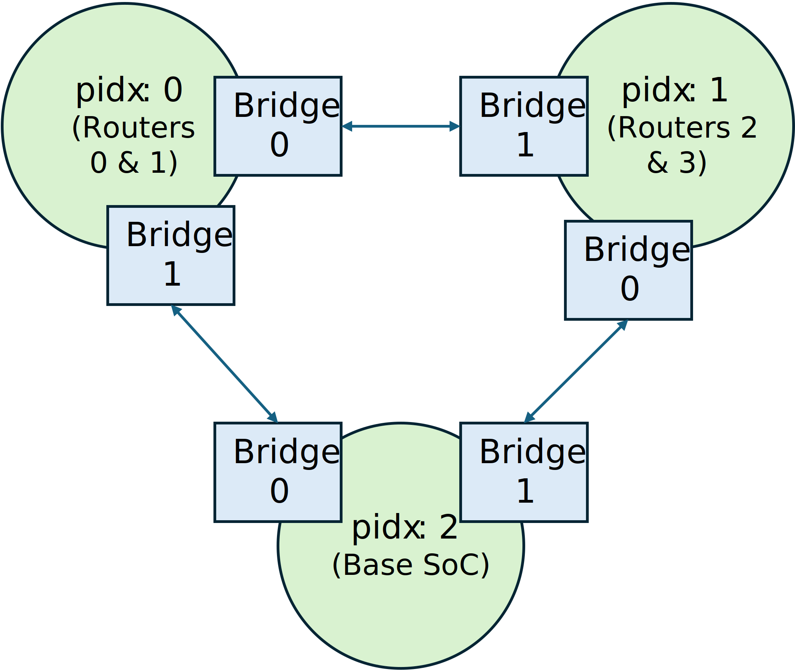

Running NoC Partition Mode Simulations
======================================

In this section, we provide a step-by-step tutorial on how to partition a SoC with a
ring NoC containing four tiles into 3 FPGAs connected as a ring. We will run this on the
local Xilinx Alveo U250 FPGAs. Note that this feature is *highly experimental and has
not been tested on EC2 F1*. This assumes that you have read the :ref:`FireAxe running
fast-mode simulations <FIREAXE-FAST-MODE>`.

Some caveats of this mode:

- You have to *disable TracerV* by mixing in the ``WithNoTraceIO`` configuration
  fragment to the ``TARGET_CONFIG``.
- Works only for mesh or ring based NoC topologies where each FPGA is connected to
  exactly 2 other FPGAs.

1. Building Partitioned Sims: Setting up FireAxe Target configs
---------------------------------------------------------------

Similarily to the :ref:`fast-mode <FIREAXE-FAST-MODE>`, we need to setup the FireAxe
target configurations. One change to note is that we are now using the ``WithQSFP``
configuration fragment. With this information, FireAxe will generate an Aurora IP in the
FPGA shell to exchange data between multiple FPGAs using the QSFP interconnects. Also,
note that we added the ``WithFireAxeNoCPart``. This tells the compiler to perform the
NoC-partition pass by grouping router nodes and modules connected to those router nodes.
The indices in ``WithPartitionGlobalInfo`` now indicates the router node indices.

.. literalinclude:: ../../../sim/midas/src/main/scala/configs/FireAxeTargetConfigs.scala
    :language: scala
    :start-after: DOC include start: Xilinx U250 Ring NoC Partition
    :end-before: DOC include end: Xilinx U250 Ring NoC Partition

2. Building Partitioned Sims: `config_build_recipes.yaml`
---------------------------------------------------------

We can specify the ``config_build_recipes.yaml`` at this point.

.. literalinclude:: ../../../deploy/sample-backup-configs/sample_config_build_recipes.yaml
    :language: yaml
    :start-after: DOC include start: Xilinx U250 NoC Partition Build Recipe
    :end-before: DOC include end: Xilinx U250 NoC Partition Build Recipe

3. Running Partitioned Simulations: `user_topology.py`
------------------------------------------------------

Once again, we need to specify the FireAxe topology to run simulations.

.. literalinclude:: ../../../deploy/runtools/user_topology.py
    :language: python
    :start-after: DOC include start: user_topology.py fireaxe_ring_noc_config
    :end-before: DOC include end: user_topology.py fireaxe_ring_noc_config

Lets look at how the FireAxe topology is set in this example. We can see that bridge 0
of partition ``N`` is always connected to bridge 1 of partition ``(N + 1) % NFPGAs`` and
bridge 1 of partition ``N`` is always connected to bridge 0 of partition ``(N + NFPGAs -
1) % NFPGAs``.

We can specify the above topology as below:

.. literalinclude:: ../../../deploy/runtools/user_topology.py
    :language: python
    :start-after: DOC include start: fireaxe_ring_noc_config edges
    :end-before: DOC include end: fireaxe_ring_noc_config edges

4. Running Partitioned Simulations: `config_runtime.yaml`
---------------------------------------------------------

Now we can update ``config_runtime.yaml`` to run FireAxe simulations.

.. code-block:: yaml

    target_config:
        topology: fireaxe_rocket_ring_noc_config
