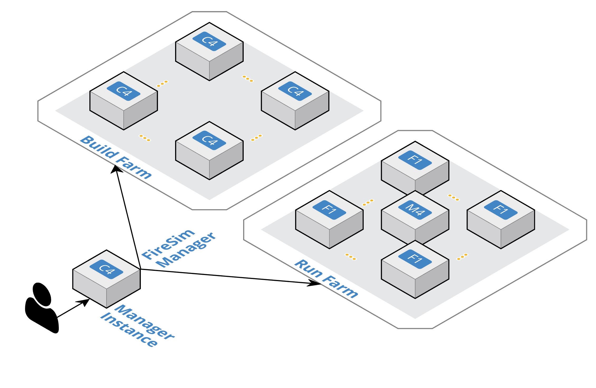

.. _firesim-basics:

FireSim Basics
===================================

FireSim is a cycle-accurate, FPGA-accelerated scale-out computer system
simulation platform developed in the Berkeley Architecture Research Group in
the EECS Department at the University of California, Berkeley.

FireSim is capable of simulating from **one to thousands of multi-core compute
nodes**, derived from **silicon-proven** and **open** target-RTL, with an optional
cycle-accurate network simulation tying them together. FireSim runs on FPGAs in **public
cloud** environments like AWS EC2 F1, removing the high capex traditionally
involved in large-scale FPGA-based simulation, as well as on on-premise FPGAs.

FireSim is useful both for datacenter architecture research as well as running
many single-node architectural experiments in parallel on FPGAs. By harnessing
a standardized host platform and providing a large amount of
automation/tooling, FireSim drastically simplifies the process of building and
deploying large-scale FPGA-based hardware simulations.

To learn more, see the `FireSim website <https://fires.im>`__ and the FireSim
`ISCA 2018 paper <https://sagark.org/assets/pubs/firesim-isca2018.pdf>`__.

For a two-minute overview that describes how FireSim simulates a datacenter,
see our ISCA 2018 lightning talk `on YouTube <https://www.youtube.com/watch?v=4XwoSe5c8lY>`__.

Three common use cases:
--------------------------

Single-Node Simulation In Parallel Using On-Premise FPGAs
^^^^^^^^^^^^^^^^^^^^^^^^^^^^^^^^^^^^^^^^^^^^^^^^^^^^^^^^^

In this mode, FireSim allows for simulation of individual Rocket
Chip-based nodes without a network, which allows individual simulations to run
at ~150 MHz. The FireSim manager has the ability to automatically distribute
jobs to on-premise FPGAs allowing users to harness existing FPGAs for quick turnaround time and
maximum flexibility. For example, users can run all of SPECInt2017 on Rocket Chip
in ~1 day by running the 10 separate workloads in parallel on 10 on-premise FPGAs.

Single-Node Simulation In Parallel Using Cloud FPGAs
^^^^^^^^^^^^^^^^^^^^^^^^^^^^^^^^^^^^^^^^^^^^^^^^^^^^^^^^^

In this mode, FireSim allows for simulation of individual Rocket
Chip-based nodes without a network, which allows individual simulations to run
at ~150 MHz. The FireSim manager has the ability to automatically distribute
jobs to many parallel simulations running on cloud FPGAs, expediting the process of running large
workloads like SPEC. For example, users can run all of SPECInt2017 on Rocket Chip
in ~1 day by running the 10 separate workloads in parallel on 10 FPGAs hosted in the cloud.

Datacenter/Cluster Simulation
^^^^^^^^^^^^^^^^^^^^^^^^^^^^^^^^^^^^

In this mode, FireSim also models a cycle-accurate network with
parameterizeable bandwidth and link latency, as well as configurable
topology, to accurately model current and future datacenter-scale
systems. For example, FireSim has been used to simulate 1024 quad-core
Rocket Chip-based nodes, interconnected by a 200 Gbps, 2us network. To learn
more about this use case, see our `ISCA 2018 paper
<https://sagark.org/assets/pubs/firesim-isca2018.pdf>`__ or `two-minute lightning talk
<https://www.youtube.com/watch?v=4XwoSe5c8lY>`__.

Other Use Cases
---------------------

This release does not support a non-cycle-accurate network as our `AWS Compute Blog Post/Demo
<https://aws.amazon.com/blogs/compute/bringing-datacenter-scale-hardware-software-co-design-to-the-cloud-with-firesim-and-amazon-ec2-f1-instances/>`__
used. This feature will be restored in a future release.

If you have other use-cases that we haven't covered, feel free to contact us!

Background/Terminology
---------------------------

   FireSim Infrastructure Diagram

**FireSim Manager** (``firesim``)
  This program (available on your path as ``firesim``
  once we source necessary scripts) automates the work required to launch FPGA
  builds and run simulations. Most users will only have to interact with the
  manager most of the time. If you're familiar with tools like Vagrant or Docker, the ``firesim``
  command is just like the ``vagrant`` and ``docker`` commands, but for FPGA simulators
  instead of VMs/containers.

**Manager Instance**
  This is the main host (ex. AWS EC2 instance or local machine) that you will
  SSH-into and do work on. This is where you'll clone your copy of FireSim and
  use the FireSim Manager to deploy builds/simulations from.

**Build Farm**
  These are instances that are managed by the FireSim manager when you run FPGA builds.
  The manager will automatically ship source for builds to these instances and
  run the Verilog -> FPGA Image process on them.

**Run Farm**
  These are a collection of instances that the manager
  manages and deploys simulations onto. You can use multiple
  Run Farms in parallel, to run multiple separate
  simulations in parallel.

To disambiguate between the computers being simulated and the computers doing
the simulating, we also define:

**Target**
  The design and environment under simulation. Generally, a
  group of one or more multi-core RISC-V microprocessors with or without a network between them.

**Host**
  The computers executing the FireSim simulation -- the **Run Farm** from above.

We frequently prefix words with these terms. For example, software can run
on the simulated RISC-V system (*target*-software) or on a host x86 machine (*host*-software).

**Golden Gate (MIDAS II)**
  The FIRRTL compiler used by FireSim to convert target RTL into a decoupled
  simulator. Formerly named MIDAS.

Using FireSim/The FireSim Workflow
-------------------------------------

The tutorials that follow this page will guide you through the complete flow for
getting an example FireSim simulation up and running using AWS EC2 F1. At the end of this
tutorial, you'll have a simulation that simulates a single quad-core Rocket
Chip-based node with a 4 MB last level cache, 16 GB DDR3, and no NIC. After
this, you can continue to a tutorial that shows you how to simulate
a globally-cycle-accurate cluster-scale FireSim simulation. The final tutorial
will show you how to build your own FPGA images with customized hardware.
After you complete these tutorials, you can look at the Advanced documentation
in the sidebar to the left.

Here's a high-level outline of what we'll be doing in our AWS EC2 tutorials:

#. **Initial Setup/Installation**

   a. First-time AWS User Setup: You can skip this if you already have an AWS
      account/payment method set up.

   #. Configuring required AWS resources in your account: This sets up the
      appropriate VPCs/subnets/security groups required to run FireSim.

   #. Setting up a "Manager Instance" from which you will coordinate building
      and deploying simulations.

#. **Single-node simulation tutorial**: This tutorial guides you through the process of running one simulation on a Run Farm consisting of a single ``f1.2xlarge``, using our pre-built public FireSim AGFIs.

#. **Cluster simulation tutorial**: This tutorial guides you through the process of running an 8-node cluster simulation on a Run Farm consisting of one ``f1.16xlarge``, using our pre-built public FireSim AGFIs and switch models.

#. **Building your own hardware designs tutorial (Chisel to FPGA Image)**: This tutorial guides you through the full process of taking Rocket Chip RTL and any custom RTL plugged into Rocket Chip and producing a FireSim AGFI to plug into your simulations. This automatically runs Chisel elaboration, FAME-1 Transformation, and the Vivado FPGA flow.

Generally speaking, you only need to follow step 4 if you're modifying Chisel
RTL or changing non-runtime configurable hardware parameters.

Now, hit Next to proceed with setup.
