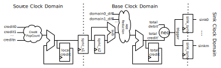
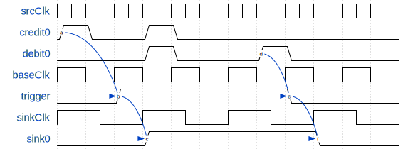

Simulation Triggers
===================

It is often useful to globally coordinate debug and instrumentation features using specific target-events that may be distributed across the target design.
For instance, you may wish to enable collection of synthesized prints and sampling of
AutoCounters simulataenously when a specific instruction is committed on any
core, or alternatively if the memory system sees a write to a
particular memory address. Golden Gate's trigger system enables this by aggregating annotated ``TriggerSources``
distributed throughout the design using a centralized credit-based system
which then drives a single-bit level-sensitive enable to all ``TriggerSinks`` distributed throughout the design.
This enable signal is asserted while the design remains in the region-of-interest
(ROI).  Sources signal the start of the ROI by granting a
credit and signal the end of the ROI by asserting a debit. Since there can be
multiple sources, each of which might grant credits, the trigger is only
disabled when the system has been debited as exactly as many times as it has
been credited (it has a balance of 0).

Quick-Start Guide
--------------------

Level-Sensitive Trigger Source
******************************

Assert the trigger while some boolean ``enable`` is true.

.. literalinclude:: ../../sim/src/main/scala/midasexamples/TriggerWiringModule.scala
    :language: scala
    :start-after: DOC include start: TriggerSource Level-Sensitive Usage
    :end-before: DOC include end: TriggerSource Level-Sensitive Usage

Caveats:
 - The trigger visible at the sink is delayed. See :ref:`trigger-timing`.
 - Assumes this is the only source; the trigger is only cleared if no additional credit has been granted.

Distributed, Edge-Sensitive Trigger Source
******************************************

Assert trigger enable when some boolean `start` undergoes a positive transition, and clear the trigger
when a second signal `stop` undergoes a positive transition.

.. literalinclude:: ../../sim/src/main/scala/midasexamples/TriggerWiringModule.scala
    :language: scala
    :start-after: DOC include start: TriggerSource Usage
    :end-before: DOC include end: TriggerSource Usage

Caveats:
 - The trigger visible at the sink is delayed. See :ref:`trigger-timing`.
 - Assumes these are the only sources; the trigger is only cleared if no additional credit has been granted.

Chisel API
-----------
Trigger sources and sinks are Boolean signals, synchronous to a particular
clock domain, that have been annotated as such.  The ``midas.targetutils``
package provides chisel-facing utilities for annotating these signals in your
design. We describe these utilities below, the source for which can be found in
``sim/midas/targetutils/src/main/scala/annotations.scala``.

Trigger Sources
***************
In order to permit distributing trigger sources across the whole design, you
must annotate distinct boolean signals as credits and debits using methods
provided by the ``TriggerSource`` object. We provide an example below (the distributed example from the quick-start guide).

.. literalinclude:: ../../sim/src/main/scala/midasexamples/TriggerWiringModule.scala
    :language: scala
    :start-after: DOC include start: TriggerSource Usage
    :end-before: DOC include end: TriggerSource Usage

Using the methods above, credits and debits issued while
the design is under reset are not counted (the reset used is implicit
reset of the Chisel Module in which you invoked the method).
If the module provides no implicit reset or if you wish to credit or debit the trigger system while the
local module's implicit reset is asserted, use ``TriggerSource.{creditEvenUnderReset, debitEvenUnderReset}`` instead.

Trigger Sinks
*************
Like sources, trigger sinks are boolean signals that have been annotated
alongside their associated clock. These signals will be driven by a Boolean
value created by the trigger system. If trigger sources exist in your design, the
generated trigger will **override all assignments made in the chisel to the same
signal**, otherwise, it will take on a default value provided by the user. We
provide an example of annotating a sink using the the ``TriggerSink`` object below.

.. literalinclude:: ../../sim/src/main/scala/midasexamples/TriggerWiringModule.scala
    :language: scala
    :start-after: DOC include start: TriggerSink Usage
    :end-before: DOC include end: TriggerSink Usage

Alternatively, if you wish to use a trigger sink as a predicate for a Chisel
``when`` block, you may use ``TriggerSink.whenEnabled`` instead

.. literalinclude:: ../../sim/src/main/scala/midasexamples/TriggerPredicatedPrintf.scala
    :language: scala
    :start-after: DOC include start: TriggerSink.whenEnabled Usage
    :end-before: DOC include end: TriggerSink.whenEnabled Usage

.. _trigger-timing:

Trigger Timing
---------------
Golden Gate implements the trigger system by generating a target circuit that
synchronizes all credit and debits into the base clock domain using a
`single` register stage, before doing a global accounting. If the total number
of credits exceeds debits the trigger is asserted. This trigger is then
synchronized in each sink domain using a single register stage before driving
the annotated sink. The circuit that implements this functionality is depicted below:

    Trigger generation circuit. Not shown: a sub-circuit analagous to that
    which totalCredit' is replicated to count debits. Similarly, the sub-circuit
    feeding the add-reduction is generated for each clock domain that contains
    at least one source annotation.

Given the present implementation, an enabled trigger becomes visible in a
sink domain no sooner than one base-clock edge and one local-clock edge have elapsed,
in that order, after the credit was asserted. This is depicted in the
waveform below.

    Trigger timing diagram.

Note that trigger sources and sinks that reside in the base clock domain still
have the additional synchronization registers even though they are uneeded. Thus, a credit issued by a
source in the base clock domain will be visible to a sink also in the base
clock domain exactly 2 cycles after it was issued.

Bridges that use the default ``HostPort`` interface add an additional cycle of
latency in the bridge's local domain since their token channels model a single
register stage to improve simulation FMR. Thus, without using a different
``HostPort`` implementation, trigger sources generated by a Bridge and trigger
sinks that feed into a Bridge will each see one additional bridge-local cycle
of latency. In constrast, synthesized printfs and assertions, and AutoCounters
all use wire channels (since they are unidirectional interfaces, the extra
register stage is not required to improve FMR) and will see no additional sink
latency.

Limitations & Pitfalls
----------------------
- The system is limited to no more than one trigger signal. Presently, there is no means to generate
  unique triggers for distinct sets of sinks.
- Take care to never issue more debits than credits, as this may falsely enable the trigger
  under the current implementation.
